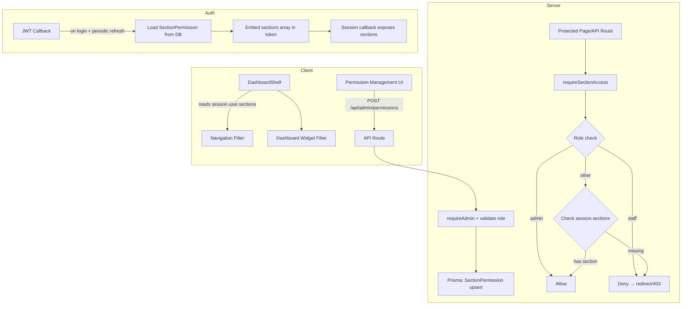

# Design Document: Feature Access Control

## Overview

This design introduces a granular, section-level access control system for Science Hub's financial dashboard sections. The current binary admin/non-admin check (hiding "Admin" and "Settings" nav items) is extended with a permission model that allows the Admin to selectively grant or revoke access to protected financial sections on a per-user basis.

The system enforces three tiers:
1. **Admin** — full unrestricted access, no permission records needed
2. **Staff** — permanently blocked from all protected sections (role-based hard deny)
3. **Grantable Users** — access denied by default; Admin can grant individual section access via a `SectionPermission` table

Protected sections include: Sales Overview, Purchase Overview, Reports Sales, Reports Purchases, Payments Received, Payments Made, and the Dashboard Sales/Purchases KPI widgets.

### Design Decisions

| Decision | Rationale |
|----------|-----------|
| Store permissions in a dedicated `SectionPermission` table | Separates concerns from the User model; extensible for future section additions |
| Embed granted sections in the JWT token | Avoids extra DB queries on every page navigation; aligns with existing JWT strategy |
| Re-fetch permissions on `jwt` callback's periodic DB check | Piggybacks on the existing 5-minute tokenVersion re-check interval |
| Use a `requireSectionAccess()` helper in `apiAuth.ts` | Consistent pattern with existing `requireSession()` / `requireAdmin()` |
| No middleware file — use per-route server-side checks | Project has no existing middleware; per-route checks are already the established pattern |
| Client-side filtering in DashboardShell uses session permissions | Zero extra API calls for nav rendering; consistent with current `adminOnly` filtering |

## Architecture



### Request Flow for Protected Route

1. User navigates to `/sales` (protected section: `sales_overview`)
2. Server component or API route calls `requireSectionAccess("sales_overview")`
3. Helper calls `getServerSession()` → reads `session.user.role` and `session.user.sections`
4. If role is `admin` → allow immediately
5. If role is `staff` → redirect to `/dashboard` (pages) or return 403 (API)
6. Otherwise, check if `"sales_overview"` exists in `session.user.sections` array
7. If present → allow; otherwise → redirect/403

## Components and Interfaces

### 1. Database Layer — Prisma Model

**File:** `prisma/schema.prisma`

```prisma
model SectionPermission {
  id        String   @id @default(cuid())
  userId    String
  section   String   // "sales_overview" | "purchase_overview" | "reports_sales" | "reports_purchases" | "payments_received" | "payments_made"
  enabled   Boolean  @default(false)
  createdAt DateTime @default(now())
  updatedAt DateTime @updatedAt
  user      User     @relation(fields: [userId], references: [id], onDelete: Cascade)

  @@unique([userId, section])
  @@index([userId])
}
```

Add to the `User` model:
```prisma
sectionPermissions SectionPermission[]
```

### 2. Shared Constants

**File:** `src/lib/sections.ts`

```typescript
export const PROTECTED_SECTIONS = [
  "sales_overview",
  "purchase_overview",
  "reports_sales",
  "reports_purchases",
  "payments_received",
  "payments_made",
] as const;

export type ProtectedSection = (typeof PROTECTED_SECTIONS)[number];

/** Maps a route path to the section permission required to access it */
export const ROUTE_SECTION_MAP: Record<string, ProtectedSection> = {
  "/sales": "sales_overview",
  "/purchases": "purchase_overview",
  "/reports/sales": "reports_sales",
  "/reports/purchases": "reports_purchases",
  "/sales/payments": "payments_received",
  "/purchases/payments": "payments_made",
};

/** Maps a section to its human-readable label */
export const SECTION_LABELS: Record<ProtectedSection, string> = {
  sales_overview: "Sales Overview",
  purchase_overview: "Purchase Overview",
  reports_sales: "Reports Sales",
  reports_purchases: "Reports Purchases",
  payments_received: "Payments Received",
  payments_made: "Payments Made",
};

/** Sections that control dashboard widget visibility */
export const DASHBOARD_WIDGET_SECTIONS = {
  salesWidgets: "sales_overview" as ProtectedSection,
  purchasesWidgets: "purchase_overview" as ProtectedSection,
};
```

### 3. Auth Integration — JWT & Session

**File:** `src/lib/auth.ts` (modifications to existing)

In the `jwt` callback, after fetching the user from DB (the periodic check block):

```typescript
// Load section permissions for the user
const permissions = await prisma.sectionPermission.findMany({
  where: { userId: token.id as string, enabled: true },
  select: { section: true },
});
token.sections = permissions.map((p) => p.section);
```

On initial login (`if (user)` block):
```typescript
const permissions = await prisma.sectionPermission.findMany({
  where: { userId: user.id, enabled: true },
  select: { section: true },
});
token.sections = permissions.map((p) => p.section);
```

In the `session` callback:
```typescript
session.user.sections = (token.sections as string[]) ?? [];
```

**Type extension** (`src/types/next-auth.d.ts`):
```typescript
declare module "next-auth" {
  interface Session {
    user: {
      id: string;
      name?: string | null;
      email?: string | null;
      role: string;
      sections: string[];
    };
  }
}
```

### 4. Server-Side Access Control Helper

**File:** `src/lib/apiAuth.ts` (new export)

```typescript
import { ROUTE_SECTION_MAP, ProtectedSection } from "@/lib/sections";

/**
 * Enforces section-level access. Admin always passes.
 * Staff always fails. Grantable users need the section in their token.
 */
export async function requireSectionAccess(section: ProtectedSection): Promise<AuthResult> {
  const auth = await requireSession();
  if (!auth.ok) return auth;

  const { role, sections } = auth.session.user;

  // Admin bypasses all section checks
  if (role === "admin") return auth;

  // Staff permanently denied
  if (role === "staff") {
    return { ok: false, response: NextResponse.json(
      { error: "Insufficient section permissions" }, { status: 403 }
    )};
  }

  // Grantable user — check section array
  if (!sections?.includes(section)) {
    return { ok: false, response: NextResponse.json(
      { error: "Insufficient section permissions" }, { status: 403 }
    )};
  }

  return auth;
}
```

### 5. Navigation Filter Enhancement

**File:** `src/components/layout/DashboardShell.tsx` (modifications)

Add a `sectionRequired` field to the `NavItem` interface and populate it for protected nav items:

```typescript
interface NavItem {
  href: string;
  label: string;
  iconKey: string;
  adminOnly: boolean;
  sectionRequired?: ProtectedSection;
}
```

Filtering logic change:
```typescript
const visibleItems = group.items.filter((item) => {
  if (item.adminOnly && session?.user?.role !== "admin") return false;
  if (item.sectionRequired) {
    if (session?.user?.role === "admin") return true;
    if (session?.user?.role === "staff") return false;
    return session?.user?.sections?.includes(item.sectionRequired) ?? false;
  }
  return true;
});
```

### 6. Dashboard Widget Filter

**File:** `src/app/(dashboard)/dashboard/page.tsx` (modifications)

Read session sections and conditionally render Sales/Purchases KPI and recent tables:

```typescript
const { data: session } = useSession();
const role = session?.user?.role;
const sections = session?.user?.sections ?? [];

const canSeeSales = role === "admin" || (role !== "staff" && sections.includes("sales_overview"));
const canSeePurchases = role === "admin" || (role !== "staff" && sections.includes("purchase_overview"));
```

Wrap the Sales KPIs + Recent Invoices in `{canSeeSales && (...)}` and Purchases KPIs + Recent Bills in `{canSeePurchases && (...)}`.

### 7. Permission Management API

**File:** `src/app/api/admin/permissions/route.ts`

```typescript
// GET — list all grantable users with their section permissions
// POST — toggle a section permission for a user
//   body: { userId: string, section: ProtectedSection, enabled: boolean }
//   Validates: user exists, role is not "admin" or "staff"
//   Uses upsert with the composite unique [userId, section]
```

### 8. Permission Management UI

**File:** `src/app/(dashboard)/admin/permissions/page.tsx`

A client component accessible at `/admin/permissions`:
- Fetches all grantable users with their permissions via GET
- Displays a table: user name | email | one toggle per protected section
- Toggle fires a POST immediately (optimistic UI with rollback on error)
- Shows toast confirmation on success, reverts + error toast on failure
- Only accessible by Admin (server-side redirect for non-admin)

## Data Models

### SectionPermission Table

| Column | Type | Constraints | Description |
|--------|------|-------------|-------------|
| id | String (cuid) | PK | Unique record identifier |
| userId | String | FK → User.id, CASCADE delete | The user this permission belongs to |
| section | String | Part of composite unique | One of the 6 protected section identifiers |
| enabled | Boolean | Default: false | Whether access is granted |
| createdAt | DateTime | Default: now() | Record creation timestamp |
| updatedAt | DateTime | @updatedAt | Last modification timestamp |

**Constraints:**
- `@@unique([userId, section])` — one record per user/section pair
- `@@index([userId])` — fast lookup by user
- `onDelete: Cascade` on user FK — cleanup when user deleted

### Section Identifier Enum (application-level)

```
"sales_overview" | "purchase_overview" | "reports_sales" | "reports_purchases" | "payments_received" | "payments_made"
```

### Session Token Shape (JWT payload addition)

```typescript
{
  // ...existing fields
  sections: string[]  // array of enabled section identifiers for the user
}
```

### Permission API Request/Response

**POST `/api/admin/permissions`**

Request:
```json
{
  "userId": "cuid_string",
  "section": "sales_overview",
  "enabled": true
}
```

Response (success):
```json
{ "ok": true, "permission": { "userId": "...", "section": "sales_overview", "enabled": true } }
```

Response (error — staff/admin target):
```json
{ "error": "Cannot modify permissions for this user role" }
```


## Correctness Properties

*A property is a characteristic or behavior that should hold true across all valid executions of a system — essentially, a formal statement about what the system should do. Properties serve as the bridge between human-readable specifications and machine-verifiable correctness guarantees.*

### Property 1: Admin bypass

*For any* user with role "admin" and *for any* protected section, the access evaluation function SHALL return "allow", regardless of whether SectionPermission records exist, are enabled, or are disabled for that user.

**Validates: Requirements 1.1, 1.3, 1.4, 1.5**

### Property 2: Staff hard deny

*For any* user with role "staff" and *for any* protected section, the access evaluation function SHALL return "deny", regardless of whether enabled SectionPermission records exist for that user.

**Validates: Requirements 2.1, 2.2, 2.3, 2.5**

### Property 3: Grantable user access equals enabled set

*For any* user whose role is neither "admin" nor "staff", and *for any* protected section, the access evaluation function SHALL return "allow" if and only if the section appears in the user's set of enabled permissions. All sections not in the enabled set SHALL be denied.

**Validates: Requirements 3.1, 3.2, 3.3, 4.1, 4.2, 5.1, 5.2, 8.5**

### Property 4: Permission grant validation

*For any* user whose role is "admin" or "staff", and *for any* protected section, the permission management function SHALL reject the operation and not persist a record.

**Validates: Requirements 2.4, 4.5**

### Property 5: Manageable users exclusion

*For any* set of users in the system, the permission management user list SHALL contain only users whose role is neither "admin" nor "staff".

**Validates: Requirements 6.4**

### Property 6: Defensive deny on malformed session

*For any* session token where the sections field is undefined, null, not an array, or contains non-string values, the access evaluation function SHALL treat the effective permissions set as empty and deny access to all protected sections.

**Validates: Requirements 9.5**

## Error Handling

| Scenario | Behavior |
|----------|----------|
| Permission load fails during login | Return `null` from `authorize()` — login fails with generic "invalid credentials" message; no partial session is created |
| Permission toggle API fails (DB error) | Return 500 with `{ error: "Failed to update permission" }`; client reverts toggle to previous state and shows error toast |
| Malformed toggle request body | Return 400 with `{ error: "Invalid request: userId, section, and enabled are required" }` |
| Invalid section identifier in request | Return 400 with `{ error: "Invalid section identifier" }` |
| Target user not found | Return 404 with `{ error: "User not found" }` |
| Target user is admin or staff | Return 403 with `{ error: "Cannot modify permissions for this user role" }` |
| Unauthorized access to permission management | Redirect to `/dashboard` (page) or 403 (API) |
| Session token missing sections field | Treat as empty array — deny all protected sections |
| Network failure on toggle (client-side) | Optimistic update rolls back; error toast displayed |

## Testing Strategy

### Property-Based Tests

This feature is well-suited for property-based testing because the access control logic is a pure function of (role, sections, targetSection) with well-defined universal properties across a large input space.

**Library:** [fast-check](https://github.com/dubzzz/fast-check) (TypeScript PBT library)

**Configuration:**
- Minimum 100 iterations per property
- Each test tagged with: `Feature: feature-access-control, Property {N}: {title}`

**Properties to implement:**
1. Admin bypass — generate admin users × all sections → always allow
2. Staff hard deny — generate staff users × all sections (with/without permission records) → always deny
3. Grantable user access equals enabled set — generate users with random subsets of enabled sections → access matches set membership
4. Permission grant validation — generate admin/staff users × sections → grant rejected
5. Manageable users exclusion — generate user lists with mixed roles → filtered list contains only grantable roles
6. Defensive deny on malformed session — generate malformed sections values → always deny

### Unit Tests (Example-Based)

- Dashboard widget visibility: `canSeeSales` true when session has `"sales_overview"`, false otherwise
- Dashboard widget visibility: `canSeePurchases` true when session has `"purchase_overview"`, false otherwise
- Permission management UI: non-admin redirected from `/admin/permissions`
- Permission API: valid toggle request returns success response
- Permission API: malformed body returns 400
- Auth flow: DB failure during permission load causes login rejection

### Integration Tests

- Protected page route: staff user accessing `/sales` gets redirected to `/dashboard`
- Protected API route: grantable user without permission gets 403 from `/api/reports`
- Unauthenticated user accessing protected route gets redirected to `/login`
- Permission cascade: deleting a user removes their SectionPermission records
- Token refresh: updated permissions appear in session after JWT refresh cycle
- Permission toggle API round-trip: toggle on → verify access granted → toggle off → verify access denied

### Smoke Tests

- Prisma schema: `SectionPermission` table has composite unique `[userId, section]`
- `PROTECTED_SECTIONS` constant contains exactly 6 expected values
- New `SectionPermission` record defaults `enabled` to `false`
